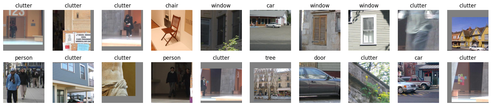
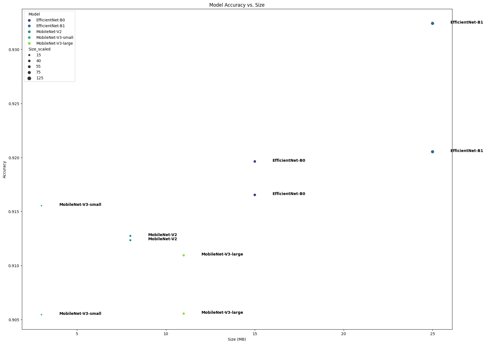

# LabelMe-Classification-AI

Welcome to the LabelMe Classification AI project! This project focuses on training a model on the LabelMe 12 50K dataset and deploying it as a web application using Gradio. Below, you'll find important information about the dataset, project goals, experiments, deployment, and future work.

## 1) Dataset

The dataset used for this project is the [LabelMe 12 50k dataset](https://www.kaggle.com/datasets/dschettler8845/labelme-12-50k), which consists of 50,000 JPEG images divided into 12 classes:
- Person
- Car
- Building
- Window
- Tree
- Sign
- Door
- Bookshelf
- Chair
- Table
- Keyboard
- Head

Half of the images are classified as clutter, created by randomly selecting regions from the images. This dataset is highly challenging due to variations in appearance, lighting conditions, angle of view, and partial occlusions. In the original paper by the dataset creators, the achieved accuracy rate was 83.73%. You can find the paper [here](https://people.csail.mit.edu/brussell/research/AIM-2005-025-new.pdf).

To get an idea of the dataset's noise and misclassifications, view the [random_samples.jpg](random_samples.png) image.

## 2) Targets

The primary project goal was to train a model that achieves a test accuracy of at least 90% while maintaining real-time execution on average hardware, approximately 30 frames per second (0.03 seconds) on a CPU.

## 3) Experiments

To achieve real-time execution, several experiments were conducted using PyTorch. Five different models were evaluated:
- EfficientNet-B0
- EfficientNet-B1
- MobileNet-V2
- MobileNet-V3-small
- MobileNet-V3-large

Each model was trained for 10 and 5 epochs, and the results of these experiments are summarized in . Notably, MobileNet-V3-small emerged as the preferred choice due to its competitive accuracy and small model size.

The model's performance is showcased in the [predict.ipynb](predict.ipynb) notebook, where it's tested on local files to ensure correct functionality.

## 4) Deployment

The model has been deployed as a web application using Gradio, and you can access it [here](https://huggingface.co/spaces/AlbertHunduza/LabelMe-Classifier). Feel free to test it out, have fun with it, and report any false classifications to help improve the model's performance.

## 5) Future Work

For future work, there are two main objectives:
- Improve the model's accuracy beyond the current 91%.
- Incorporate additional datasets to enable the model to classify more than the existing 12 classes.

Your contributions and suggestions are welcome to help us achieve these goals!

Thank you for your interest in LabelMe Classification AI.
